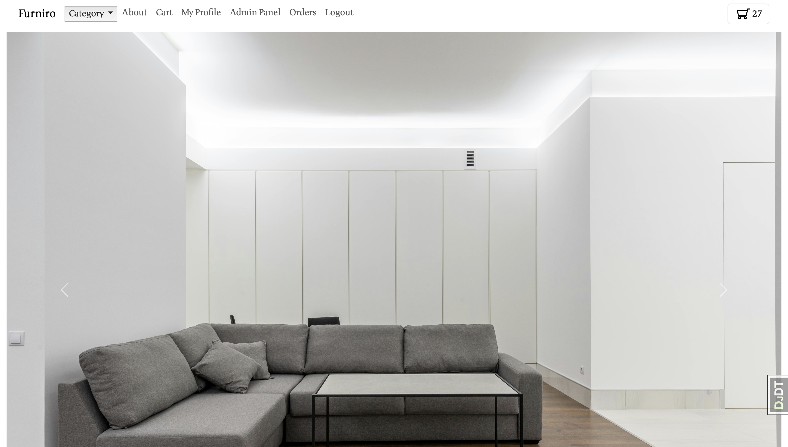
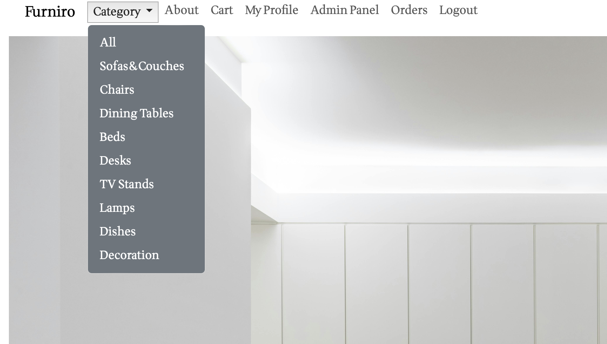
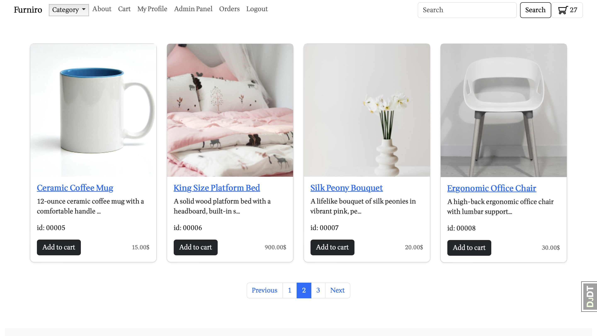
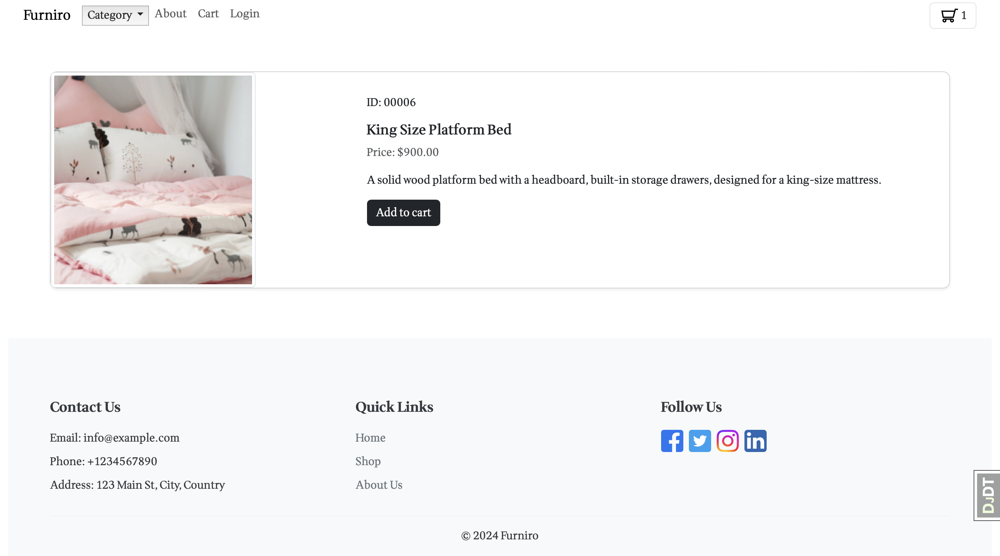
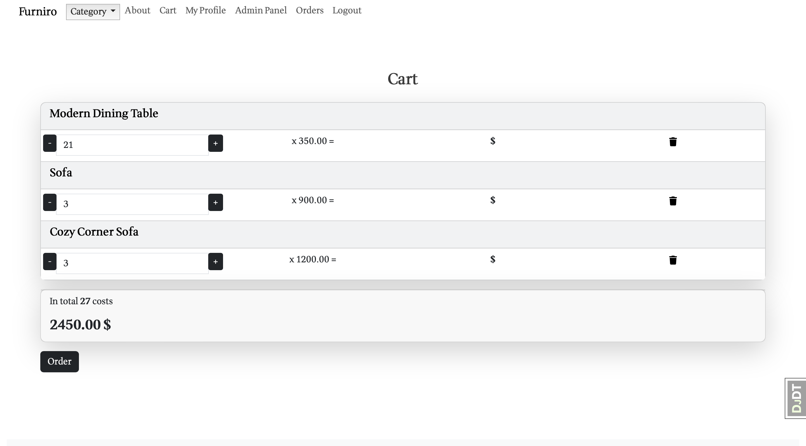
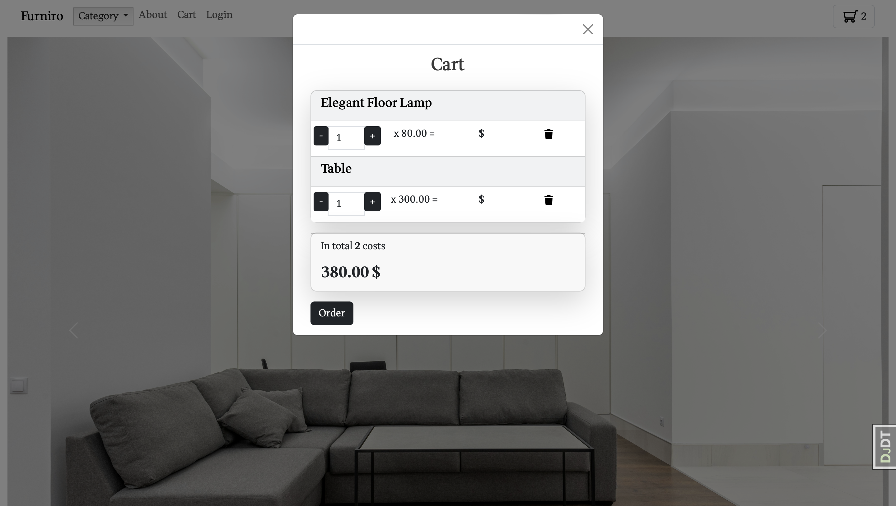
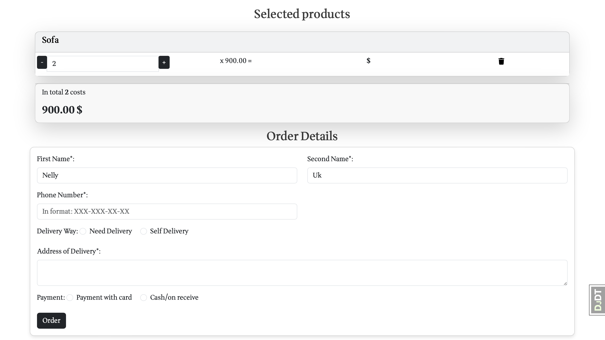
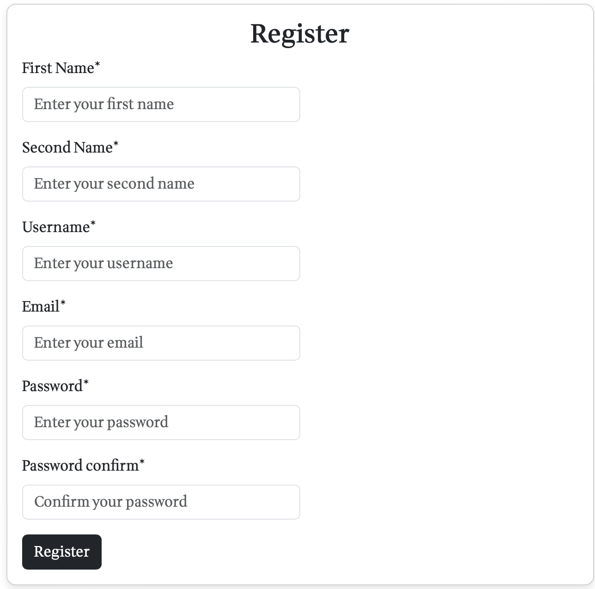
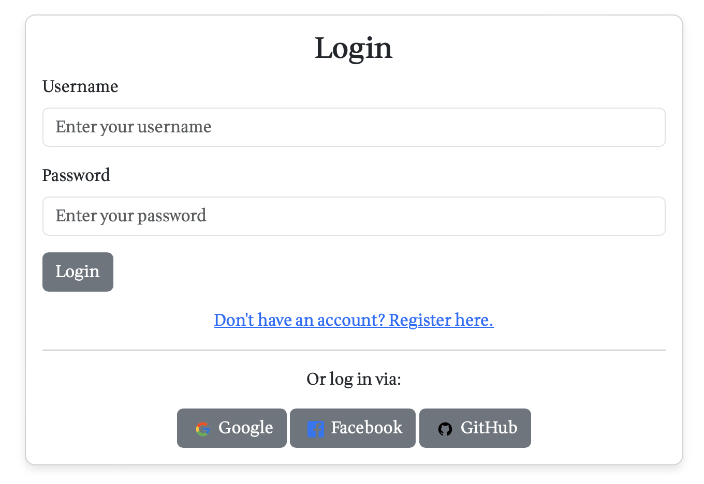
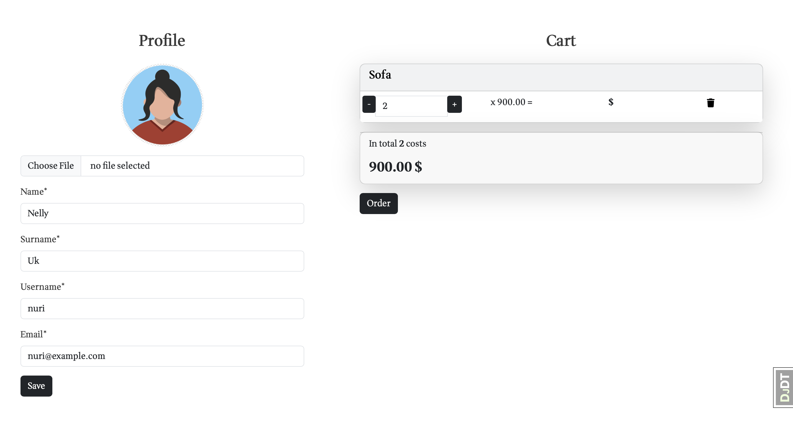

# FurniStore Online Store Website

Furniro is a dynamic e-commerce platform built with Django REST framework, designed to offer users an immersive 
shopping experience. The website uses HTML, CSS, Bootstrap, and JavaScript with AJAX for a seamless and interactive interface, supported by a PostgreSQL database for robust data management and transactions.

## Features

- **Product Categories:** Explore a variety of product categories.
- **Product Listings:** View detailed product listings including descriptions, prices, and images.
- **Shopping Cart:** Add products to the cart and proceed to checkout.
- **Search Functionality:** Search for products by keywords or categories.
- **User Authentication:** Register and log in to access personalized features.
- **User Profile:** Track your cart and orders in your profile.
- **Seller Features:** Register as a seller and list your own products.
- **Admin Dashboard:** Manage users, products, and orders via the admin panel.
- **Pagination:** Easily navigate through product listings with pagination.
- **Inspiration Rooms:** feature showcases a curated gallery of room setups that users can view for design ideas.

### Main Page

The main page provides an overview of the website's offerings, including navigation to various sections.

### Inspiration Rooms

The Inspiration Rooms section showcases curated galleries of room setups, providing design ideas and inspiration.

### Footer of the Page

The footer includes additional navigation links, contact information, and social media icons.

### Different Categories

This section displays various product categories available on the site, allowing users to explore different types of products.

### Products

The product listings show detailed information about each item, including images, descriptions, and prices.

### Product Card

Each product card provides a snapshot of the product's details and a link to view more information or add it to the cart.

### Cart Page

The cart page displays the items added to the cart, with options to modify quantities or proceed to checkout.

### Cart Modal Window

The cart modal window provides a quick view of cart contents without leaving the current page.

### Order Page

The order page allows users to review their order details, enter shipping information, and complete the purchase.

### Registration Form

The registration form enables new users to create an account by entering their personal details.

### Login Form

The login form allows users to access their accounts by entering their username and password.

### Profile Form

The profile form lets users update their personal information and view their account details.


## Installation

1. **Clone the Repository:**

    ```bash
    git clone https://github.com/saikaldi/FurnitureStore.git
    cd OnlineStore-Funiro
    ```

2. **Create and Activate a Virtual Environment:**

    ```bash
    python -m venv venv
    source venv/bin/activate  # On Windows, use `venv\Scripts\activate`
    ```

3. **Install Dependencies:**

    ```bash
    pip install -r requirements.txt
    ```

4. **Configure the Database:**

    - Set up PostgreSQL and configure the database settings in `settings.py`.

5. **Apply Migrations:**

    ```bash
    python manage.py migrate
    ```

6. **Create a Superuser:**

    ```bash
    python manage.py createsuperuser
    ```

7. **Run the Development Server:**

    ```bash
    python manage.py runserver
    ```

8. **Access the Website:**

    Visit [http://localhost:8000/](http://localhost:8000/) in your web browser.

## Contributing

1. **Fork the Repository.**
2. **Create a Feature Branch:**

    ```bash
    git checkout -b feature/my-feature
    ```

3. **Commit Your Changes:**

    ```bash
    git commit -am 'Add some feature'
    ```

4. **Push to the Branch:**

    ```bash
    git push origin feature/my-feature
    ```

5. **Create a Pull Request.**

## Deployment

For deploying the project to production, follow the specific instructions for your hosting provider or deployment service. You can use platforms like Heroku, AWS, or DigitalOcean.

## Troubleshooting

If you encounter issues, check the following:

- **Database Configuration:** Ensure PostgreSQL is properly configured.
- **Dependencies:** Verify all required packages are installed.
- **Django Logs:** Review the server logs for errors.


Feel free to adjust the content based on your project specifics, additional features, or any other relevant details. The `README.md` file serves as the primary documentation for your project and should be updated as needed.
